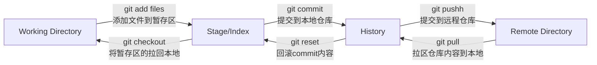

> 简单快速的入门 git 基本命令如何使用；如何创建仓库、如何提交托管你的工程项目……

<!-- MORE -->

### 一、版本控制

​	在一个工程项目中存在不同的版本，例如工作报告中的项目报告1、项目报告2、项目报告最终版、项目报告最终版2等等。

​	版本控制（Revision control）是一种在开发过程中用于管理我们对文件、目录或者工程等内容的修改，方便查看或更改历史记录，备份以便于恢复某个版本的技术。

​	在多人开发时控制的作用就显得更为明显

### 二、基础命令

#### 2.1. 查看 git 配置

```bash
git config -list|cat	# 查看 git 所有配置
git config --global --list|cat	# 查看 git 本地配置
```

#### 2.2. 配置连接 git

在控制本地计算机连接 git 时 必须对 `user.name(用户名)`、`user.email(用户邮箱)` 使用如下命令进行配置

```bash
git config --global user.name "moekylin"	# 用户名
git config --global user.email “moekylin@qq.com” # 邮箱
```

> git 配置默认文件都保存在本地文件夹内，不止使用命令，甚至可以通过打开文件进行修改，不过并不推荐使用其他方式，防止出现不必要的报错

### 三、知识拓展

首先 Git 在本地有三个区域，分别为：工作目录（Working Directory）、暂存区（Stage/Index）、资源库（Repository）。以及在云端还有一个 git 仓库（Remote Directory）



- Workspace：工作区，存放着本地项目代码
- Index/Stage：暂存区，存放临时的改动（即将提交的信息）
- Repository：仓库区（或本地仓库），存放数据的位置，存放着所有版本的数据，其中HEAD指向最新放入仓库的数据
- Remote：远程仓库：托管代码的服务器，通常就是存放着项目的服务器

### 四、上传你的项目

#### 4.1. 初始化仓库

```bash
git init
```

#### 4.2. 查看文件状态

```bash
git status
```

#### 4.3. 跟踪文件

```bash
git add .	# .代表所有文件，跟踪目录内所有文件；也可以替换.选择指定指定文件夹或文件
```

#### 4.4. 提交到本地仓库

```bash
git commit -m	"消息内容"	# 提交暂存区的内容到本地仓库 -m 提交信息
# 此时也可以使用 git status 查看本地文件状态
```

#### 4.5. 忽略提交

> 在提交你的项目源码时，某些文件（例.idea、npm_moudles）是不需要提交的，为减少冗余可以通过配置.gitignore文件来指定不需要提交的文件

```yaml
# 为注释
*.txt		# 所有.txt结尾的文件
!lib.txt	# lib.txt 无视规则
/tmp		# 根目录下的 tmp，不包含其他目录的tmp文件夹
build/	# build/目录下的所有文件夹
doc/*.txt	# doc/目录下所有.txt后缀的文件
```

#### 4.6. 拉区远程仓库

```bash
git clone https://github.com/moekylin/GitLearn.git
```

#### 4.7. 提交本地内容

```bash
echo "这里储存着我的第一次提交和修改内容 commit 为 Fuck" >> README.txt	# 创建文件
git add .		# 添加所有文件到暂存区
git commit -m "Fuck"	# 指定备注为Fuck
git push origin main	# 提交到远程仓库的main分支
```

### 五、git分支

> 不同的分支存在着不同版本的项目，当然在github pages也就是个人博客内，我试着尝试用main分支提供访问的，source分支作为源码，img分支作为图床来进行，以便于统一操作的管理。有关这些内容如果可行，那么我也会进行总结。
